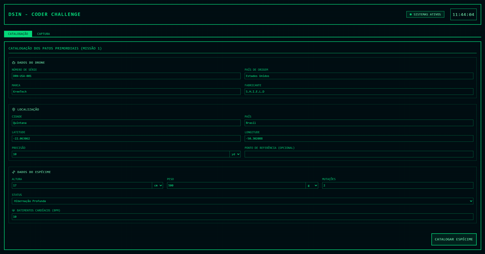

# DSIN CODER CHALLENGE - ETAPA BÔNUS

## Sobre o Projeto

Este projeto foi desenvolvido como parte da etapa bônus do DSIN CODER CHALLENGE 2025. Ele permite catalogar as principais informações coletadas sobre os Patos Primordiais encontrados, visualizar os dados de captura para avaliar o quão benéfica pode ser a captura de um determinado espécime e controlar o drone responsável pela operação, ativando modos de ataque e defesa conforme necessário.

A interface adota um estilo retrô-futurista, combinando a aparência de um antigo terminal de computador com elementos modernos. Essa estética foi pensada para refletir a temática do desafio, inspirando-se em histórias de ficção científica e no contraste entre o passado e o futuro.

## Preview do projeto



## Tecnologias utilizadas

### Frontend

- React
- TypeScript
- TailwindCSS
- Vite

### Backend

- Node.js
- Express
- CORS

## Acesse o projeto

Link para acessar o projeto hospedado: [dsin-coder-challenge.vercel.app](https://dsin-coder-challenge.vercel.app)

Observações: O projeto hospedado pode apresentar certa lentidão nas requisições. Para uma experiência mais rápida e fluida, recomenda-se executá-lo localmente seguindo as instruções abaixo.

## Pré-requisitos

Antes de começar, você precisará ter as seguintes ferramentas instaladas em sua máquina:

- Node.js (versão 18.x ou superior)
- npm (geralmente instalado junto com o Node.js)

## Como Rodar o Projeto Localmente:

Siga os passos abaixo para executar a aplicação em seu ambiente de desenvolvimento.

### 1. Clone o Repositório

```bash
git clone https://github.com/guilherme-dds/dsin-coder-challenge.git
cd dsin-coder-challenge
```

### 2. Configure e Inicie o Backend

Abra um terminal e navegue até a pasta `backend`.

```bash
# Navegue até a pasta do backend
cd backend

# Instale as dependências
npm install

# Inicie o servidor de desenvolvimento
node --watch server.js
```

O servidor backend estará rodando em `http://localhost:3000`.

### 3. Configure e Inicie o Frontend

Abra **outro terminal** e navegue até a pasta `frontend`.

```bash
# Navegue até a pasta do frontend (a partir da raiz do projeto)
cd frontend

# Instale as dependências
npm install

# Inicie o servidor de desenvolvimento
npm run dev
```

O servidor frontend estará disponível em `http://localhost:5173` (ou outra porta, se a 5173 estiver em uso). Abra este endereço no seu navegador para ver a aplicação funcionando.

---
